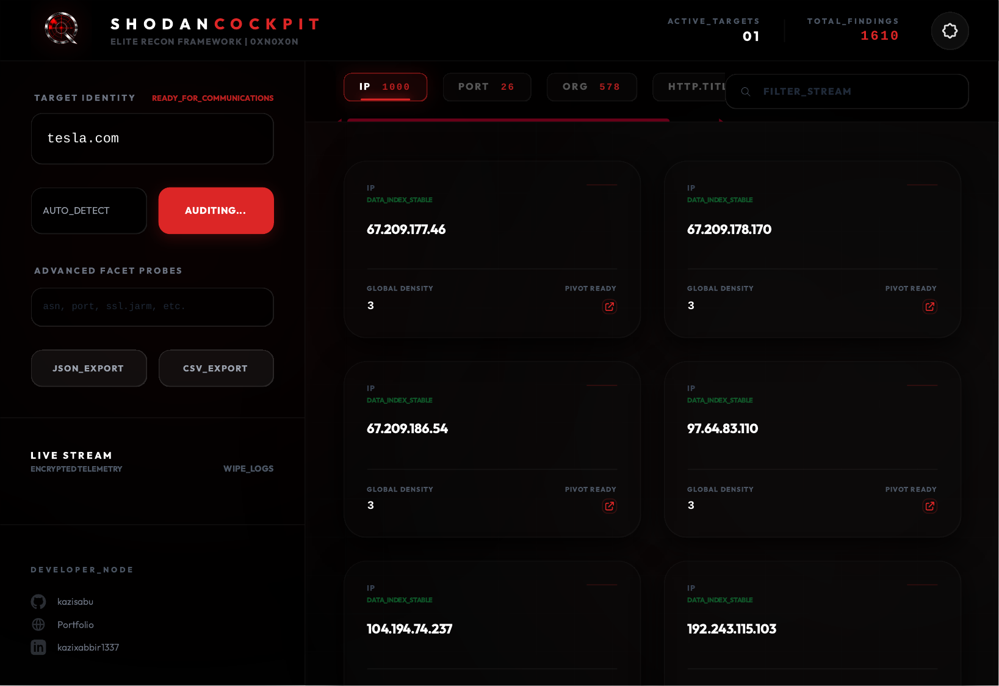

# 🎯 SHODAN ULTIMATE COCKPIT
### Elite Recon Framework & Stealth Dashboard
**Author:** Kazi Sabbir (QUANTA/0xN0X0N)  

---

## 🚀 Overview
**Shodan Ultimate Cockpit** is a high-performance, purely client-side OSINT framework designed for Bug Bounty hunters and Red Team operators. It provides a visual, real-time interface for probing Shodan facets without the need for a local backend, making it perfectly suited for **GitHub Pages** hosting.

Built with a **Gold Standard** aesthetic, it features virtualized rendering for large data sets, multi-strategy proxy support, and context-aware pivoting for surgical reconnaissance.

---

## ✨ Key Features

### 🛡️ Stealth & Performance
- **Pure Client-Side**: No server required. Run it from your browser or host it on GitHub Pages.
- **Virtualized Rendering**: Handles thousands of results (IPs, Vulns, Ports) without lag using a lazy-rendering engine.
- **Stealth Transmission**: Exclusively utilizes private **Cloudflare Workers** to bypass detection and rate limits, providing a secure and dedicated communication relay.

### 🔍 Advanced Recon Logic
- **Precision Targeting**: Intelligent auto-detection for Domains, Subdomains, IPs, and CIDR ranges.
- **Organization Audit**: Dedicated mode for entity-based infrastructure discovery.
- **Global Query Mode**: Direct bridge to Shodan's raw query language for custom technology hunting.
- **Advanced Facet Probes**: Manually specify facets (e.g., `asn, jarm, http.waf`) for custom mission requirements.

### 🕹️ High-Speed Pivot Station
- **Context-Aware Redirection**: Every result card is a live bridge. Clicking a card opens a new Shodan search **automatically scoped to your active target**.
- **Dual-Format Export**: Instantly export your entire recon session to structured **JSON** or **CSV** for reporting or further automation.
- **Neural Telemetry**: A real-time log feed provides encrypted telemetry on every probe and signal.

---

## ⚙️ Configuration
Access the **Neural_Config** (Gear Icon) to set up your mission parameters:
- **Discord Audit Webhook**: Automatically exfiltrate major findings to your Discord channel.
- **Custom Relay**: Input your own Cloudflare Worker URL for maximum stealth and dedicated bandwidth.
---

## ⚖️ Disclaimer
This tool is for educational purposes and authorized security auditing only. Ensure you comply with Shodan's Terms of Service and local laws.

**Happy Hunting.** 🎯🏆
